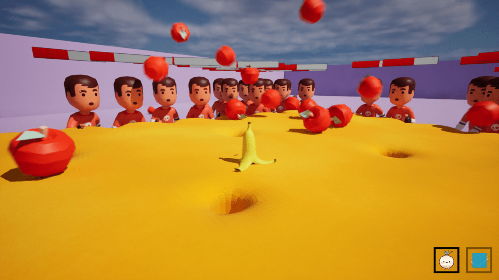

A survival game in which players control a banana trying to avoid being eaten by hungry humans.

## 📥 Download

## 🕹️ How To Play

The humans are constantly chasing after the banana, trying to eat it. The goal of the game is simply to survive the longest time possible. To help him in his survival, the player has the following abilities.

- Attack (Left-Click) &ndash; Throws big apples at humans, dealing damage to them.
- Skill (E-Key) &ndash; Spawns a cute onion, acting as a decoy for humans.
- Ultimate (R-Key) &ndash; Summons a giant biscuit platform, pushing away every human around.

When an ability is used, it goes into cooldown. Then, at the bottom-right of the screen, we can see the remaining time before being able to use the ability again.

When a human gets too close, it eats the banana, leading to a game over. From this moment, a menu showcasing the player's statistics will be displayed.

https://github.com/user-attachments/assets/9770115d-2534-4711-b55f-bf7666b85f0f

---

  Copyright &#169; 2024 PyroWilDx. All Rights Reserved.

